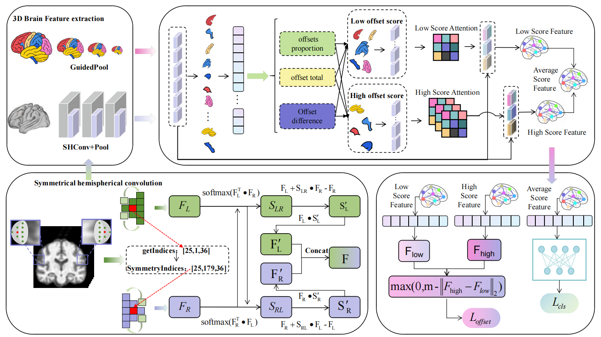

# SHRNet:Symmetrical Hemispherical Convolution and Regional Offset Scoring for Brain Image Analysis
## Usage
### 1、Data
Available:  https://ADNI.loni.usc.edu

Available: https://www.oasis-brains.org
   
the Alzheimer’s Disease Neuroimaging Initiative (ADNI) database and the Open Access Series of Imaging Studies (OASIS) dataset.We collected 785 samples from ADNI1  and ADNI2. The dataset includes from 236 Alzheimer’s disease(AD) patients, 262 cognitively normal(HC) patients, and 114 MCIc(MCI patients who will convert to AD) and 173 MCInc (MCI patients who will not convert to AD).The OASIS dataset consists of T1-weighted MRI images from
203 participants, including 121 AD patients and 82 HC
subjects.

### 2、Preprocessing
To process MRI images, we used the open-source tools Statistical Parametric Mapping (SPM) and Computational Anatomy Toolbox (CAT12). CAT12 is especially useful for handling low-resolution images because it uses internal interpolation during calculations.

### 3、Run
run 'model_train.py'. (The code for the model module will be open-sourced during the manuscript accepted.)

### 4、Model

